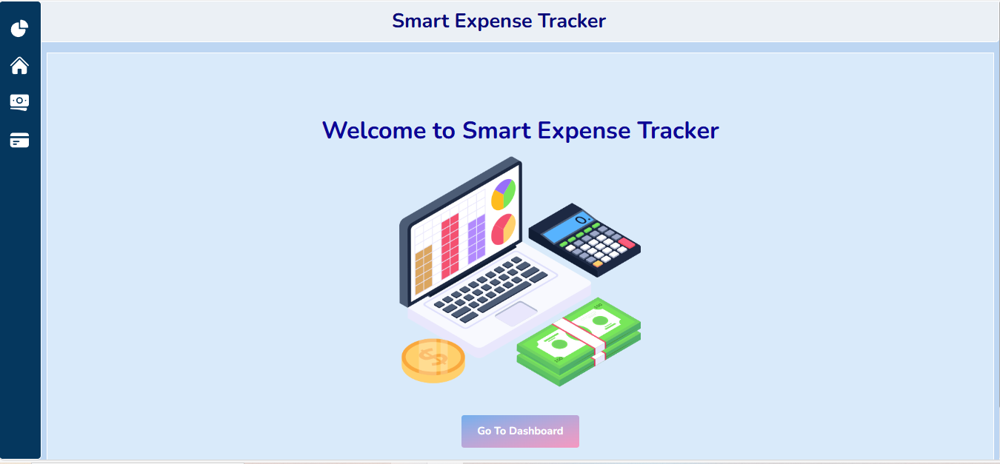

# 📊 Smart Expense Tracker

A simple, clean web application to **track income, expenses, balance, and spending categories** — built with **ReactJS** and **Tailwind CSS**. Visualize spending with **charts** and see where your money goes.

---

## ✨ Features

- ✏ Add & edit **incomes** and **expenses**

- 🧪 Filter expenses by **date, amount,** and **category**

- 📃 View **totals** and **category-wise** breakdown.

- 📈 Visual **Pie Chart** for Spending Breakdown

- 🗂 **Summary Cards**: Income, Expense, Balance

- 🧾 View All Transactions in One Place

- 🎨 Clean, responsive dashboard for desktop & mobile

- 📁 Data Saved in **Local Storage**

- 📆 **Datepicker** for customizable date input

- 🔔 Notify using **react-toastify** when added & deleted income and expense

---

## ⚙️ Tech Stack
- ⚛ ReactJS + Context API

- 🎨 Tailwind CSS

- 🔹 Heroicons

- 🧿 Recharts for charts

- 🌌 Lottie for Animations

---

## 📂 Project Structure

📦 SmartExpenseTracker
 ┣ 📂 src
 ┃ ┣ 📂 components
 ┃ ┃ ┣ Home.jsx
 ┃ ┃ ┣ SummaryCards.jsx
 ┃ ┃ ┣ ExpenseChart.jsx
 ┃ ┃ ┣ Transactions.jsx
 ┃ ┃ ┣ CategoryTotals.jsx
 ┃ ┃ ┣ AddIncomeForm.jsx
 ┃ ┃ ┣ IncomeList.jsx
 ┃ ┃ ┣ AddExpenseForm.jsx
 ┃ ┃ ┣ ExpenseList.jsx
 ┃ ┃ ┣ FilterPanel.jsx
 ┃ ┃ ┣ MobileViewHomePage.jsx
 ┃ ┣ App.jsx
 ┃ ┣ index.css
 ┃ ┣ main.jsx

 ---

## ❓ Why This Project?
✅ Demonstrates React state management, context usage, conditional rendering, and responsive design.
✅ Clean and clear component-based architecture.
✅ Perfect mini project to showcase skills on your resume or portfolio.

---

## 🤝 What I Learned

Built with React hooks, context for global state, and reusable components. Practiced clean UI design and responsive layouts.

---

## 📸 Preview

